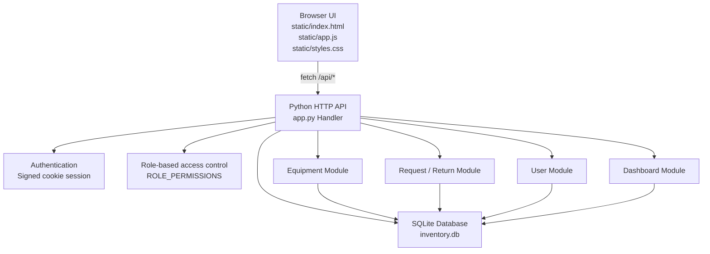
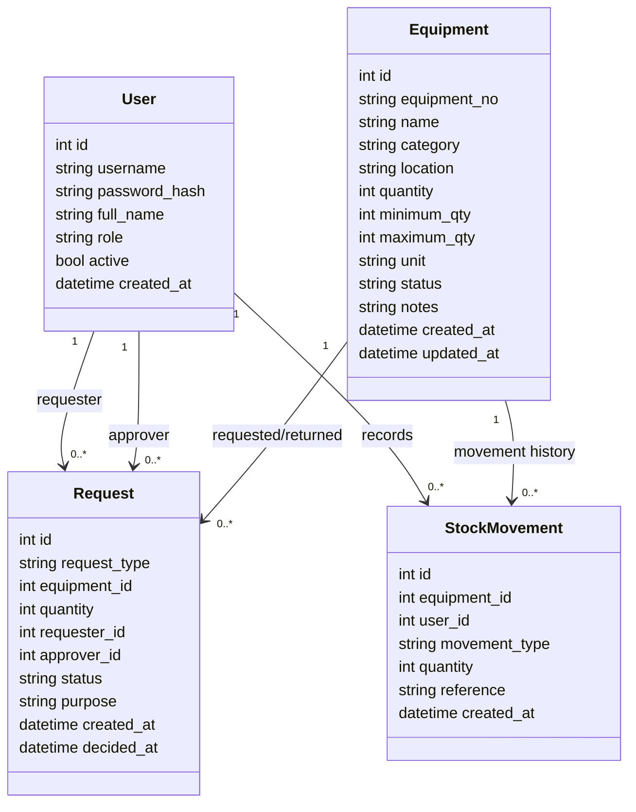
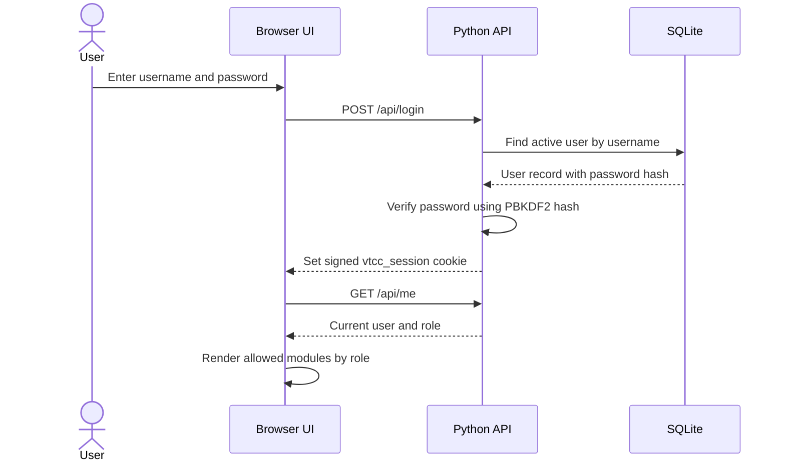
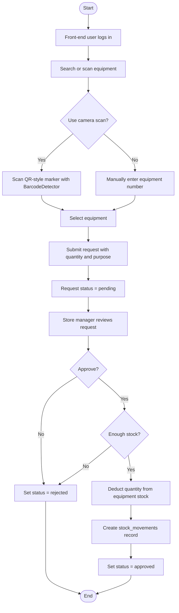
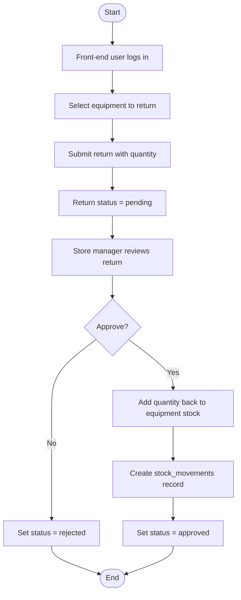
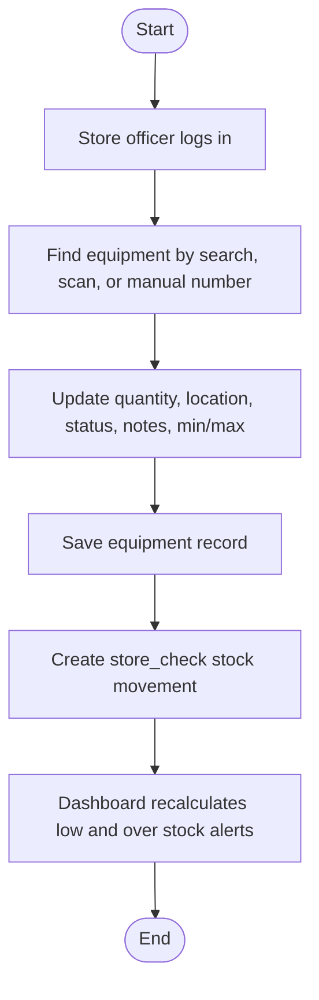
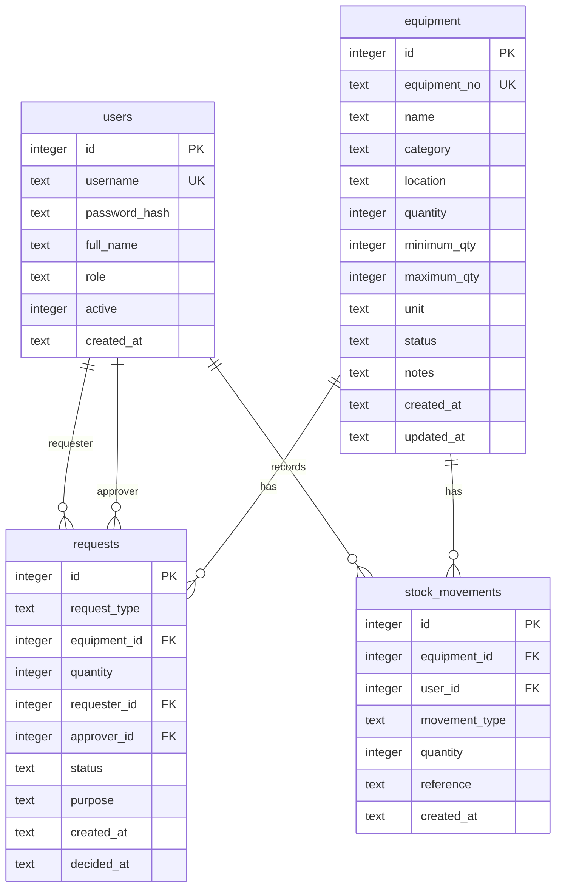

# VTCC Maintenance Store Inventory - UML, Workflow, and Database Structure

This document describes the current system design for the VTCC Maintenance Store Inventory application.

## 1. System Overview

The application is a browser-based inventory system with a Python standard-library HTTP server, SQLite database, and static HTML/CSS/JavaScript frontend.

Main modules:

- Authentication and role-based access control
- Equipment inventory CRUD
- User management
- Equipment request and return workflow
- Store manager approval and rejection
- Store stock checking and updates
- QR-style equipment marker display
- Browser camera scanning with `BarcodeDetector` when supported
- Manual equipment number search
- Dashboard for stock alerts and recent movement history

## 2. Roles and Permissions

| Role | Main Access |
| --- | --- |
| `administrator` | All modules: users, equipment, requests, dashboard |
| `front_end` | View inventory, create equipment requests, create returns |
| `store_manager` | View inventory/dashboard, approve or reject requests and returns |
| `store` | View inventory/dashboard, update store equipment and stock check records |

Permission mapping:

| Permission | administrator | front_end | store_manager | store |
| --- | --- | --- | --- | --- |
| User management | Yes | No | No | No |
| Equipment read | Yes | Yes | Yes | Yes |
| Equipment create/update/delete | Yes | No | No | Yes |
| Request/return create | Yes | Yes | No | No |
| Request/return approve | Yes | No | Yes | No |
| Dashboard read | Yes | No | Yes | Yes |
| Stock movement/check | Yes | No | No | Yes |

## 3. Use Case UML

```mermaid
flowchart LR
    Administrator["Administrator"]
    FrontEnd["Front-end User"]
    StoreManager["Store Manager"]
    Store["Store Officer"]

    Login(("Log in / log out"))
    ViewInventory(("View equipment inventory"))
    ManageEquipment(("Create / update / delete equipment"))
    ManageUsers(("Create / update / deactivate users"))
    RequestEquipment(("Request equipment"))
    ReturnEquipment(("Return equipment"))
    ApproveRequest(("Approve / reject requests"))
    ApproveReturn(("Approve / reject returns"))
    UpdateStock(("Check and update store stock"))
    ScanQR(("Scan QR-style equipment marker"))
    ManualSearch(("Manual equipment number entry"))
    Dashboard(("View dashboard alerts"))
    History(("View request, approval, and stock movement history"))

    Administrator --> Login
    Administrator --> ViewInventory
    Administrator --> ManageEquipment
    Administrator --> ManageUsers
    Administrator --> RequestEquipment
    Administrator --> ReturnEquipment
    Administrator --> ApproveRequest
    Administrator --> ApproveReturn
    Administrator --> Dashboard
    Administrator --> History

    FrontEnd --> Login
    FrontEnd --> ViewInventory
    FrontEnd --> RequestEquipment
    FrontEnd --> ReturnEquipment
    FrontEnd --> ScanQR
    FrontEnd --> ManualSearch
    FrontEnd --> History

    StoreManager --> Login
    StoreManager --> ViewInventory
    StoreManager --> ApproveRequest
    StoreManager --> ApproveReturn
    StoreManager --> Dashboard
    StoreManager --> History

    Store --> Login
    Store --> ViewInventory
    Store --> ManageEquipment
    Store --> UpdateStock
    Store --> ScanQR
    Store --> ManualSearch
    Store --> Dashboard
    Store --> History
```



## 4. Component UML



## 5. Class / Domain Model UML



## 6. Main Workflow

### 6.1 Login and Authorization



### 6.2 Equipment Request Workflow



### 6.3 Equipment Return Workflow



### 6.4 Store Stock Update Workflow



## 7. API Structure

| Method | Endpoint | Purpose | Required Permission |
| --- | --- | --- | --- |
| `POST` | `/api/login` | Authenticate user and set session cookie | Public |
| `POST` | `/api/logout` | Clear session cookie | Authenticated |
| `GET` | `/api/me` | Get current signed-in user | Public |
| `GET` | `/api/dashboard` | Dashboard totals, stock alerts, recent movements | `dashboard:read` |
| `GET` | `/api/equipment` | List/search equipment | `inventory:read` |
| `POST` | `/api/equipment` | Create equipment | `inventory:update` |
| `GET` | `/api/equipment/{id_or_no}` | Get equipment detail and recent movements | `inventory:read` |
| `PUT` | `/api/equipment/{id}` | Update equipment and record store check | `inventory:update` |
| `DELETE` | `/api/equipment/{id}` | Delete equipment | `inventory:update` |
| `GET` | `/api/requests` | List requests/returns | Authenticated |
| `POST` | `/api/requests` | Create request or return | `request:create` and `return:create` for returns |
| `PUT` | `/api/requests/{id}` | Approve, reject, or complete request/return | `request:approve` |
| `GET` | `/api/users` | List users | Administrator |
| `POST` | `/api/users` | Create user | Administrator |
| `PUT` | `/api/users/{id}` | Update user | Administrator |
| `DELETE` | `/api/users/{id}` | Deactivate user | Administrator |

## 8. Database Structure

### 8.1 Entity Relationship Diagram



### 8.2 Table: `users`

Stores login accounts and roles.

| Column | Type | Constraint / Meaning |
| --- | --- | --- |
| `id` | `INTEGER` | Primary key, auto increment |
| `username` | `TEXT` | Unique, required |
| `password_hash` | `TEXT` | Required PBKDF2 hash in `salt$digest` format |
| `full_name` | `TEXT` | Required display name |
| `role` | `TEXT` | Required; one of `administrator`, `front_end`, `store_manager`, `store` |
| `active` | `INTEGER` | Required; `1` active, `0` inactive |
| `created_at` | `TEXT` | Default current timestamp |

### 8.3 Table: `equipment`

Stores inventory master data and current stock level.

| Column | Type | Constraint / Meaning |
| --- | --- | --- |
| `id` | `INTEGER` | Primary key, auto increment |
| `equipment_no` | `TEXT` | Unique equipment number, required |
| `name` | `TEXT` | Required equipment name |
| `category` | `TEXT` | Required category |
| `location` | `TEXT` | Required store location |
| `quantity` | `INTEGER` | Current quantity in store |
| `minimum_qty` | `INTEGER` | Dashboard low-stock threshold |
| `maximum_qty` | `INTEGER` | Dashboard over-stock threshold |
| `unit` | `TEXT` | Unit of measure; default `pcs` |
| `status` | `TEXT` | Default `available`; examples: `available`, `maintenance`, `retired` |
| `notes` | `TEXT` | Optional notes |
| `created_at` | `TEXT` | Default current timestamp |
| `updated_at` | `TEXT` | Default current timestamp; updated when equipment changes |

### 8.4 Table: `requests`

Stores both equipment issue requests and return requests.

| Column | Type | Constraint / Meaning |
| --- | --- | --- |
| `id` | `INTEGER` | Primary key, auto increment |
| `request_type` | `TEXT` | Required; `request` or `return` |
| `equipment_id` | `INTEGER` | Required foreign key to `equipment.id` |
| `quantity` | `INTEGER` | Required, must be greater than 0 |
| `requester_id` | `INTEGER` | Required foreign key to requesting `users.id` |
| `approver_id` | `INTEGER` | Nullable foreign key to approving `users.id` |
| `status` | `TEXT` | Required; `pending`, `approved`, `rejected`, or `completed` |
| `purpose` | `TEXT` | Optional reason or note |
| `created_at` | `TEXT` | Default current timestamp |
| `decided_at` | `TEXT` | Approval/rejection/completion timestamp |

### 8.5 Table: `stock_movements`

Stores inventory history for approved requests, approved returns, and store checks.

| Column | Type | Constraint / Meaning |
| --- | --- | --- |
| `id` | `INTEGER` | Primary key, auto increment |
| `equipment_id` | `INTEGER` | Required foreign key to `equipment.id` |
| `user_id` | `INTEGER` | Required foreign key to `users.id` |
| `movement_type` | `TEXT` | Examples: `request`, `return`, `store_check` |
| `quantity` | `INTEGER` | Signed quantity; negative for issue/request, positive for return |
| `reference` | `TEXT` | Optional reference such as `Request #12` or `Store stock check/update` |
| `created_at` | `TEXT` | Default current timestamp |

## 9. Stock Rules

| Scenario | Stock Change | Movement Record |
| --- | --- | --- |
| Request approved | `equipment.quantity - request.quantity` | `movement_type = request`, negative quantity |
| Return approved | `equipment.quantity + request.quantity` | `movement_type = return`, positive quantity |
| Request rejected | No stock change | No movement record |
| Return rejected | No stock change | No movement record |
| Store stock update | Quantity replaced by store-entered value | `movement_type = store_check` |

Dashboard alert rules:

- Below minimum: `quantity < minimum_qty`
- Above maximum: `maximum_qty > 0 AND quantity > maximum_qty`

## 10. Database DDL

```sql
CREATE TABLE IF NOT EXISTS users (
    id INTEGER PRIMARY KEY AUTOINCREMENT,
    username TEXT UNIQUE NOT NULL,
    password_hash TEXT NOT NULL,
    full_name TEXT NOT NULL,
    role TEXT NOT NULL CHECK(role IN ('administrator','front_end','store_manager','store')),
    active INTEGER NOT NULL DEFAULT 1,
    created_at TEXT NOT NULL DEFAULT CURRENT_TIMESTAMP
);

CREATE TABLE IF NOT EXISTS equipment (
    id INTEGER PRIMARY KEY AUTOINCREMENT,
    equipment_no TEXT UNIQUE NOT NULL,
    name TEXT NOT NULL,
    category TEXT NOT NULL,
    location TEXT NOT NULL,
    quantity INTEGER NOT NULL DEFAULT 0,
    minimum_qty INTEGER NOT NULL DEFAULT 0,
    maximum_qty INTEGER NOT NULL DEFAULT 0,
    unit TEXT NOT NULL DEFAULT 'pcs',
    status TEXT NOT NULL DEFAULT 'available',
    notes TEXT DEFAULT '',
    created_at TEXT NOT NULL DEFAULT CURRENT_TIMESTAMP,
    updated_at TEXT NOT NULL DEFAULT CURRENT_TIMESTAMP
);

CREATE TABLE IF NOT EXISTS requests (
    id INTEGER PRIMARY KEY AUTOINCREMENT,
    request_type TEXT NOT NULL CHECK(request_type IN ('request','return')),
    equipment_id INTEGER NOT NULL REFERENCES equipment(id),
    quantity INTEGER NOT NULL CHECK(quantity > 0),
    requester_id INTEGER NOT NULL REFERENCES users(id),
    approver_id INTEGER REFERENCES users(id),
    status TEXT NOT NULL DEFAULT 'pending' CHECK(status IN ('pending','approved','rejected','completed')),
    purpose TEXT DEFAULT '',
    created_at TEXT NOT NULL DEFAULT CURRENT_TIMESTAMP,
    decided_at TEXT
);

CREATE TABLE IF NOT EXISTS stock_movements (
    id INTEGER PRIMARY KEY AUTOINCREMENT,
    equipment_id INTEGER NOT NULL REFERENCES equipment(id),
    user_id INTEGER NOT NULL REFERENCES users(id),
    movement_type TEXT NOT NULL,
    quantity INTEGER NOT NULL,
    reference TEXT DEFAULT '',
    created_at TEXT NOT NULL DEFAULT CURRENT_TIMESTAMP
);
```
